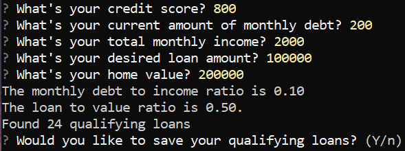
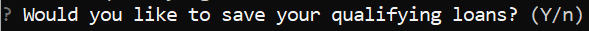

# Project Title

This application uses the command line interface to determine if a user is elligible for a loan based on obtained bank data from a csv file labeled 'daily_rate_sheet'. The application asked the users questions to evaluate their loan eligibility and then determines the number of their qualifying loans. The user is able to save a list of their qualifying loans to a new csv labeled 'qualifying_data.csv'.

---

## Technologies

This project leverages python 3.7 with the following packages:

* [fire](https://github.com/google/python-fire) - For the command line interface, help page, and entrypoint.

* [questionary](https://github.com/tmbo/questionary) - For interactive user prompts and dialogs

---

## Installation Guide

Before running the application first install the following dependencies.

```python
  pip install fire
  pip install questionary
```

---

## Usage

To use the loan qualifier application simply clone the repository and run the **app.py** with:

```python
python app.py
```

Once the command is run you will see these prompts:



Once a user has viewed their number of loans. They can save their bank data to a csv file:



If they choose yes, their data will be saved to a csv file named 'qualifying_data.csv'

---

## Contributors

Kristen Potter:
* Email: kristendmr@msn.com
* LinkedIn Url: [Kristen Potter Linkedin](https://www.linkedin.com/in/kristen-potter-b17826113)

---

## License

MIT
